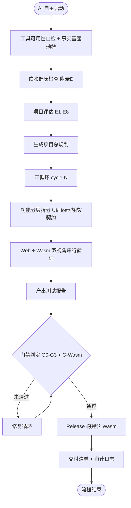

# dsh-codegraph-visualizer 迭代驱动验证流程

> **版本**：v2.0（2026-08-28）
> **定位**：dsh-codegraph-visualizer 项目「AI 全自动自主迭代驱动验证 + 评估优化升级」全流程手册
> **对标**：DSH 官方插件开发规范（deepseek-harness）+ 长期愿景六维标杆
> **事实基座**：本手册所有命令与路径均可在本仓库直接执行/定位；版本基线见附录 D

---

## 一、快速开始

```
① AI 自主启动：工具可用性自检（codegraph / codebase-memory）
   事实基座抽验（文档引用的路径/命令存在性）+ 真实数据哈希固定
② 依赖健康检查：按附录 D §1.2 执行并登记结论
③ 项目评估：AI 自主执行总评估 → 每循环增量评估
   → 产出《项目评估报告.md》（G0 门禁，E1-E8 八维 + 四层摘要）
④ 总控：AI 生成项目总规划，声明循环划分与全过程硬约束
⑤ 循环：创建 cycle-{N} 工作区（docs/anchor/cycles/.cycles/）
⑥ 拆测：AI 功能业务架构拆分（Client UI / Host 服务 / 契约横切）
   + 用户旅程 J1-J14 正反向映射 + 覆盖缺口闭环
⑦ 验证：AI 按 Web 端 + Wasm 双视角串行 debug 验证
   → 产出测试报告 / 页面状态 / 任务清单（缺陷登记闭环）
⑧ 修复：根因诊断 → 影响范围 → 修复 + 文档 → 强制构建 → 冒烟(P0) → 全量回归
⑨ 门禁：G0–G3 + G-Wasm 全部通过
⑩ 提交：feat(cycle-{N}): 完成循环 N，任务清单全部通过
⑪ AI 复盘 + 升级评估：量化指标 → 复盘报告 → 技术债务 → 升级优化立项
⑫ Release：release 构建 + 非功能验证 + 交付清单
```

---

## 二、核心原则与硬性规范

### 2.1 十九项驱动原则（红线）

| #   | 原则               | 说明 |
| --- | ------------------ | ---- |
| P01 | 不降级             | 不因赶进度降低验收标准 |
| P02 | 不条件通过         | 任何「仅当 X 才通过」均不成立 |
| P03 | 不豁免             | 不因「老代码/非本次范围」跳过检查 |
| P04 | 不跳过             | 每 Cycle 必须完成 评估 → 拆测 → 验证 → 修复 → 回归 |
| P05 | 不流转             | 未通过项不得转移到「下个循环再说」而不登记 |
| P06 | 评估先行           | 功能验证前先做项目/功能业务架构评估 |
| P07 | 证据纪律           | 每次验证必须产出测试报告（通过/失败/断言/日志要素齐全） |
| P08 | 工具可用性门禁     | 验证开始前先检查核心工具，不可用先自动修复 |
| P09 | 环境一致性         | 验证环境统一（Node/Rust 工具链版本），固定数据版本（附录 B） |
| P10 | 数据洁净           | 每次验证后清理测试产生的临时数据 |
| P11 | 分层验证           | 测试与评估区分 Client UI / Host 服务 / 契约 |
| P12 | 量化闭环           | 性能基线、缺陷逃逸率、测试通过率、回归耗时纳入每次复盘 |
| P13 | AI 全自动自主      | AI 为全流程主执行者（L4 全自主），人类仅承担监督/审计 |
| P14 | 旅程全覆盖         | J1–J13 正反向场景 100% 通过；J14 为长期愿景层不设强制门禁 |
| P15 | 缺陷闭环           | 发现 → 登记 → 根因 → 修复 → 回归 → 关闭 → 逃逸度量 |
| P16 | 生态复用与免重轮   | 具体化为附录 D §5 选型决策表：先检索成熟库，自研须记录对照 |
| P17 | 多源对照与对齐增强 | 对照主流开源代码图谱工具能力模型，识别可借鉴机制 |
| P18 | 创新差异化         | 本插件须有差异化价值（多数据源融合、实时图谱渲染体验） |
| P19 | 六维标杆对标       | 长期愿景层：底层如 CodeSee/界面如 Readest/生态如 Legado/AI 如 ReadAny/TTS 如 Lue/笔记如 Koodo；度量对象为插件最终形态，非每循环必测 |

### 2.2 DSH 插件规范对齐（九条红线）

| # | 规范项 | 要求 | 本仓库验证方式 |
|---|--------|------|---------------|
| 1 | 注册即 effect | 所有注册经 `ctx.effect()` / `ctx.on()`，registry 返回 disposer | codegraph 扫描注册点；评审确认清理函数返回 |
| 2 | waterfall 必须委托 | 监听器必须调用 `next()`，否则短路整条链 | 评审 + 检索 `ctx.on` 回调体缺 `next()` |
| 3 | Branded ID | 跨边界 ID 使用 Branded 类型，禁止裸 string | `tests/unit/types.test.ts` + grep 裸 id 传递 |
| 4 | 声明合并事件 | Context/Events 经 declaration merging 扩展，JSDoc 带 `@mode`/`@param` | typecheck 通过 + JSDoc 抽查 |
| 5 | 封闭联合 assertNever | 判别联合 switch 以 `assertNever` 收尾 | grep switch 缺省分支 |
| 6 | ESM only | `"type": "module"`、跨包用包名、本地导入带 `.ts` | `pnpm run hygiene`（publint + NodeNext consumer check） |
| 7 | Host/Client 隔离 | Host 包注册在 tsconfig.host.json，Client 包在 tsconfig.client.json | `pnpm run typecheck` 双面零错误 |
| 8 | 能力缝三角色 | Service Definition / Service Provider / Consumer 完整成缝 | 架构评审对照 DSH architecture.md |
| 9 | 配置显式化 + fails loud | 部署相关选择为 cordis.yml 可配置项；misconfiguration 加载期报错 | 配置错误注入测试 + 评审 |

**待对齐项（登记技术债务，逐循环收敛，对齐 DSH配置文档 §6.2）**：

- Profile 分层：bundle 尚未通过 `dsh.profile.bundles` 声明（`dsh-base` 依赖未发布）
- 事件分发模式：当前事件均为 `emit` 观察模式，未使用 waterfall/serial 拦截（红线 2 为前瞻约束）
- session-persistence seam：当前自实现 SQLite 持久化，未接入 harness `session-persistence`

### 2.3 工具链与分支策略

- 所有命令经仓库根 `package.json` scripts 调用：`pnpm run typecheck / test / test:coverage / test:e2e / lint / duplication / build{,:host,:client,:web} / hygiene`
- 版本基线以附录 D §1 权威配置文件为准；禁止文档自造命令
- Git 分支策略：每次循环使用独立分支 `cycle-{N}-{scope}`，收敛后合并

### 2.4 架构与算法分析（新增）

- 关键路径必须声明复杂度预算（模板见附录 D §5.3）；超预算实现登记评估报告 E2/E5 维度
- 引入解析/搜索/缓存类能力先查附录 D §5.2 选型决策表，遵循 P16 免重轮禁令
- 算法评审纳入子规划验收项：涉及上述领域的变更须在测试报告给出复杂度说明与基准数据

---

## 三、AI 全自动自主执行模式（L4 全自主）

### 3.1 模式定义与自主性分级

| 级别 | 名称     | 特征                                                             | 人类介入频率     |
| ---- | -------- | ---------------------------------------------------------------- | ---------------- |
| L1   | 辅助执行 | AI 按人类逐条指令执行单步操作                                    | 每步             |
| L2   | 半自动   | AI 自主执行常规步骤，产物须人类审核                              | 每产物           |
| L3   | 监督自主 | AI 自主决策并执行全流程，仅 H1–H4 检查点请求人类确认             | 仅检查点         |
| L4   | 全自主   | AI 全流程自主（含 Release 自动交付与版本管理），H1–H4 自动审计化 | 无（仅事后审计） |

### 3.2 全自动自主循环总图



### 3.3 阶段自主执行规范

| 阶段 | AI 自主行为 | 自动判定规则 | 产物 |
|------|------------|-------------|------|
| 启动自检 | 检查 codegraph / codebase-memory 可用性；抽验文档引用路径/命令存在性 | 工具失败 → 自动修复 → 仍失败 → 出环境报告 | 环境问题报告 |
| 依赖健康检查 | 执行附录 D §1.2 四项命令并登记 | 有可升级项 → 按 §2 流程立项或观望 | 健康检查记录 |
| 项目评估 | 四层扫描（UI/Host/内核/契约）E1–E8 + 趋势对比 | 评估报告覆盖本循环范围才进入规划 | 《项目评估报告.md》 |
| 规划 | 生成总规划/循环规划/子规划 | 子规划必须绑定测试用例 ID | 总规划/子规划 |
| 拆测 | 功能→四层用例映射 + J1–J14 映射 + RTM | RTM 或旅程覆盖存在缺口 → 先补用例 | 「功能→测试用例」映射 |
| 验证 | Web 端 + Wasm 冒烟串行执行 + J1–J14 | 测试报告六要素齐全（附录 A §3.2） | 测试报告/页面状态 |
| 诊断修复 | 根因诊断 + 影响范围分析 + 修复+文档 | 破坏性操作 → H2 | 缺陷登记 |
| 构建回归 | 强制重建 → 冒烟(P0) → 全量回归 → 清理数据 | 构建失败 → 构建修复子流程 | 新测试报告 |
| 门禁 | G0–G3 + G-Wasm 逐项自动判定 | 判定存疑 → H4 审计 | 门禁对照 + 覆盖缺口登记 |
| 复盘 | 自动生成复盘：量化指标 + 根因聚类 + 改进措施 | 无 | 复盘报告/技术债务台账 |
| Release | release 构建 → 回归 → 非功能验证 → 交付清单 | 交付闸全绿 → 自动执行 | Release 产物/交付清单 |

### 3.4 人类监督检查点（HITL → L4 自动审计化）

| 检查点 | 触发条件 | L4 自动评估内容 | 熔断条件 |
|--------|---------|----------------|---------|
| H1 | 安全敏感操作 | 核对是否涉及真实用户数据/明文凭据 | 涉及真实用户数据且无隔离方案 |
| H2 | 破坏性操作 | 影响范围分析 + 回滚方案核对 | 影响范围不可评估或不可回滚 |
| H3 | Release 交付闸 | 门禁全绿（含 G-Wasm）+ 性能未退 >5% + 审计日志完整 | 门禁不过 / 性能退化未调查 |
| H4 | 门禁仲裁 | 复核判定依据 | 判定依据冲突或证据不足 |

### 3.5 自主性边界、熔断与失败恢复

**熔断条件（任一触发 → 自动回退 L3）**：

1. 同一异常连续 3 次自动修复失败
2. 门禁自动判定存疑且无法自动定论（H4）
3. 涉及真实用户数据 / 明文凭据且无隔离方案（H1）
4. 破坏性操作影响范围不可评估或不可回滚（H2）
5. 性能指标超预警阈值且 1 轮优化后仍未恢复
6. 人类主动要求审计 / 切换到 L3
7. 无人值守超时 / 资源上限（单会话 > 24h 或上下文水位 > 85%）
8. 自动化资源上限（累计重试 > 10 次或熔断 > 3 次）

---

## 四、开机启动、项目评估与总规划

### 4.1 开机启动（AI 自主自检）

```text
1. codebase-memory / codegraph 依据代码图谱与事实初始化知识库
2. 检查核心工具可用性（codegraph / Playwright）
   - 不可用 → 尝试自动修复 → 仍不可用 → 出具环境问题报告并暂停
3. 执行附录 D §1.2 依赖健康检查并登记结论
4. 确认真实测试数据基线（附录 B §1）哈希一致
5. 输入上一轮（如有）：测试报告、复盘报告、技术债务台账、性能基线
```

### 4.2 项目评估（AI 自主化）

**分层评估范围（两层 + 契约横切）**：

| 层 | 评估对象 | 主要事实来源 |
|----|---------|-------------|
| Client UI | packages/codegraph/ui（React 组件、状态、路由、图谱可视化） | pnpm run typecheck、oxlint、Playwright |
| Host 服务 | packages/codegraph/lib、core、doc（cordis 插件服务定义与实现；数据适配器、融合器、工具注册） | pnpm run test、typecheck |
| 能力缝 | ctx.fs / ctx.web / ctx.sessions / ctx.tools / ctx.slots 五缝声明（HLD Capability 层） | 声明合并 typecheck + 评审 |
| 契约（横切） | TS Branded 类型、Service Definition 接口签名、codegraph/* 事件 | tsc 双面构建零错误 + 类型一致性测试 |

**评估维度 E1–E8**：

| 维度 | 名称 | 关键问题 |
|------|------|---------|
| E1 | 功能覆盖 | 对照插件功能域清单（图谱构建/可视化/搜索/导航/导出）还缺什么？已实现功能是否达验收标准？ |
| E2 | 架构健康 | 三层边界是否清晰？Host/Client 隔离是否成立？依赖方向是否合理？ |
| E3 | 技术债务 | 未收敛循环遗留项、TODO/FIXME 密度、local-deps path 依赖等登记项（附录 D §4.2） |
| E4 | 测试成熟度 | 分层测试缺口、RTM 未映射功能、覆盖率是否达 vitest.config.ts 门限 |
| E5 | 性能与稳定 | 图谱渲染帧率/内存占用/数据更新时延对比基线（附录 C §4） |
| E6 | 安全与可访问 | XSS 转义/路径校验/cordis 权限面、a11y、依赖审计（pnpm audit / cargo audit） |
| E7 | 创新差异化 | 本插件是否有独特差异化价值（多数据源融合、实时图谱渲染）？长期愿景评分趋势？ |
| E8 | 多源对照增强 | 对照主流开源代码图谱工具机制是否对齐并可增强？ |

---

## 五、循环工作区（Cycle）

### 5.1 目录结构

```
docs/anchor/cycles/.cycles/
├── cycle-{N}/
│   ├── 项目评估报告.md
│   ├── 当前循环总规划.md
│   ├── 任务清单.md
│   ├── 当前循环页面状态.md
│   ├── 审计日志.md
│   ├── subplans/
│   ├── test-reports/
│   └── 交付清单.md
├── retrospectives/
└── tech-debt/
```

### 5.2 循环总规划

进入每个循环前先制定当前循环总规划，包括：

- 本循环范围与边界声明
- 增量评估结论 + 依赖健康检查结论（附录 D）
- 从总规划/上一循环继承的任务清单
- 收敛门禁 G0–G3
- 上下文预算声明

### 5.3 循环子规划（Sub-Plan）

每个子规划**必须绑定至少一个测试用例 ID，并包含文档变更验证项**：

- 命名：`cycle-{N}-subplan-{type}-{name}`（type ∈ feature / fix / complex；升级类为 `complex-upgrade-*`，流程见附录 D §2）
- 明确涉及的文件、接口、测试修改
- 声明所需工具 / 技能

---

## 六、迭代驱动验证循环

### 6.0 Phase 0：工具、数据与评估基线就绪

- 检查 codegraph / Playwright 可用性
- 执行依赖健康检查（附录 D §1.2）
- 确认真实仓库样本与测试数据就绪（附录 B §1），固定数据版本
- **G0 评估基线**：确认本循环《项目评估报告.md》已产出且通过事实基座抽验（附录 A）

### 6.1 Phase 1：功能业务架构拆测与验证

#### 6.1.1 功能分层拆分（Client UI / Host 服务 + 契约）

| 功能模块 | Client UI 对象 | Host 服务对象 | 契约 |
|---------|---------------|--------------|------|
| 仓库导入与扫描 | 仓库列表/导入交互 | CodeGraphService（lib） | Branded RepoId、校验结果结构 |
| 图谱构建与可视化 | 图谱画布/节点/边 UI | CodeGraphService | AST 解析 + 图谱生成（Wasm） | Node/Edge 结构、图谱布局参数 |
| 代码搜索 | 搜索框/结果列表 | CodeGraphService.search（SQLite FTS5） | search 倒排索引 | SearchResult 结构 |
| 代码导航 | 跳转/引用/定义 UI | CodeGraphService | 符号解析、xref 构建 | SymbolId、Location 结构 |
| 依赖分析 | 依赖图/树图 UI | DependencyService | 依赖解析、循环检测 | DependencyGraph 结构 |
| 主题与布局 | 主题切换/布局控件 | — | render theme/layout | 主题参数结构 |
| 导出与分享 | 导出配置/分享 UI | ExportService | 图谱序列化/压缩 | ExportFormat 结构 |

#### 6.1.2 用户旅程 J1–J14（重映射至插件功能域）

| 旅程 | 名称 | 关键路径（正向） | 反向/异常场景 |
|------|------|-----------------|--------------|
| J1 | 仓库导入与校验 | 导入本地仓库 → FileValidator 校验 → 扫描入库 | 错误码契约全覆盖（API契约设计 §一）：INVALID_PATH 路径穿越、UNSUPPORTED_REPO 白名单外格式、REPO_TOO_LARGE 超 500MB、CORRUPTED_REPO 损坏仓库、非 Git 仓库拒绝 |
| J2 | 图谱构建与可视化 | 仓库扫描 → AST 解析 → 图谱生成 → 画布渲染 | 超大文件解析超时、循环依赖检测、图谱布局溢出 |
| J3 | 代码搜索 | 关键词查询 → FTS5/倒排索引 → 结果定位 | 空索引、特殊字符注入面、搜索词过长 |
| J4 | 符号导航 | 点击符号 → 跳转定义/引用 | 跨文件符号、未解析符号、动态导入 |
| J5 | 依赖分析 | 生成依赖图 → 循环检测 → 高亮 | 深层嵌套依赖、外部依赖不可达 |
| J6 | 图谱布局与交互 | 拖拽/缩放/筛选 → 布局更新 | 极端节点数（>10000）、布局算法超时 |
| J7 | 导出与分享 | 选择格式 → 导出 → 下载 | 导出格式不支持、大图谱导出超时 |
| J8 | 主题与个性化 | 主题切换 → 布局偏好 → 持久化 | 主题配置冲突、偏好重置 |
| J9 | UI 与 Host 边界 | React 组件经 Host 服务取数 → 状态同步 | Client 越权访问 Host 内部实现 |
| J10 | 异常恢复与容错 | 断网/崩溃后重启 → 图谱与缓存恢复；按 LLD §5.2 降级策略验证（解析失败→部分图谱、搜索失败→本地缓存） | 缓存损坏、Wasm 实例初始化失败 |
| J11 | 插件生命周期合规 | 注册即 effect → dispose 清理 → 重载无泄漏 | 监听器泄漏、未清理 effect |
| J12 | 大仓库性能 | 万级文件仓库 → 渐进式构建 → 进度反馈 | 内存溢出、构建中断恢复 |
| J13 | 多仓库管理 | 多仓库并存 → 切换/合并/对比 | 仓库间符号冲突、路径重复 |
| J14 | 六维标杆对标（长期愿景层） | 六维评分趋势跟踪，不设每循环强制门禁 | 任一维度长期停滞 |

#### 6.1.3 Client UI 验证要点

- 组件渲染、交互（点击/拖拽/缩放/键盘）、状态正确性；加载/空/错误三态
- 可访问性（ARIA、键盘焦点）、XSS 面（代码内容渲染转义）
- 工具：Playwright（tests/e2e/）、vitest 组件级用例

#### 6.1.4 Host 服务验证要点

- Service Definition 接口契约与错误处理（禁裸抛）；注册即 effect 与 disposer 清理
- 数据一致性（图谱元数据与解析结果同步）、并发安全
- 适配器正确性：CodeGraph/Lens 适配器数据转换准确、去重策略有效
- 工具注册：`graph_status`、`graph_data`、`graph_symbol`、`graph_impact` 四工具契约对齐
- 工具：pnpm run test（packages/**/*.test.ts）、typecheck

#### 6.1.5 Host 服务验证要点

- Service Definition 接口契约与错误处理（禁裸抛）；注册即 effect 与 disposer 清理
- 数据一致性（图谱元数据与解析结果同步）、并发安全
- 适配器正确性：CodeGraph/Lens 适配器数据转换准确、去重策略有效
- 工具注册：`graph_status`、`graph_data`、`graph_symbol`、`graph_impact` 四工具契约对齐
- 工具：pnpm run test（packages/**/*.test.ts）、typecheck

#### 6.1.6 契约一致性验证

- TS 类型（含 Branded ID）与 Wasm 边界序列化结构一致：serde-wasm-bindgen 序列化往返测试
- Service Definition 签名与 Consumer 调用一致：tsc 双面构建零错误
- 事件契约一致：`lib/src/index.ts` 声明合并的五个事件（`codegraph/repo/imported`、`codegraph/repo/scanned`、`codegraph/graph/updated`、`codegraph/search/result`、`codegraph/nav/jump`）发射点与消费端对齐
- 错误码契约一致：服务抛出错误码与 `docs/API契约设计.md` 定义一一对应
- 执行 `pnpm run typecheck && pnpm run test:coverage` 确认零错误且覆盖率达标

#### 6.1.7 双视角串行执行与异常恢复

1. Web 端：`pnpm run test:e2e`（Playwright，先跑）
2. **异常恢复/混沌实验（每循环至少覆盖既有用例集并登记缺口）**：
   - 网络中断/服务失效 → `tests/e2e/chaos.spec.ts`
   - 大仓库解析超时 → `tests/e2e/large-repo.spec.ts`
   - 损坏本地仓库 → `tests/e2e/local-repos.spec.ts`
   - 缺口实验（资源耗尽/并发冲突等）→ 登记任务清单补齐

---

## 七、Release 与交付（L4 自动交付 + 版本管理）

### 7.1 Release 构建流程

1. **Release 构建**：`pnpm run build`（host + client + web 全量）
2. **发布卫生**：`pnpm run hygiene`（publint + NodeNext 消费检查）；workspace 各包 version 字段一致性核对
3. **全流程回归**：用真实数据（附录 B）完成 J1–J13 全量 + 既有混沌用例
4. **非功能验证**：性能基线对比（附录 C §4）、安全检查（audit）
5. **H3 检查点（L4 自动审计）**：交付闸评估
6. **交付清单**必须包含：
   - release 构建产物（TS lib）
   - 最终测试报告（全部结果及覆盖率）
   - 非功能验证报告
   - 验证签名
   - 文档更新记录
   - 环境配置说明（Node 工具链版本快照）
   - 数据清理记录
   - 审计日志（H1–H4 自动评估记录 + 熔断/恢复记录）

---

## 八、文档与归档

- 各循环产物归档路径与规范：见附录 A §4
- 复盘报告：`docs/anchor/cycles/.cycles/retrospectives/cycle-{N}-复盘报告.md`
- 评估报告：`cycle-{N}/项目评估报告.md`，随循环产物保留并纳入复盘对比

---

## 九、升级优化评估流程

### 9.1 升级优化项分类

| 类别 | 定义 | 典型内容 | 对应子规划类型 |
|------|------|---------|--------------|
| 评估 | 现状度量与基线建立 | 项目评估、性能基线、成熟度自评 | complex（评估专项） |
| 新增 | 全新功能模块 | 新解析格式、新图谱布局算法 | feature |
| 优化 | 不改契约下提升效率/体验 | Wasm 吞吐优化、渲染提速 | complex（perf-*） |
| 完善 | 补齐缺口与边界 | 错误态补齐、文档补全 | fix |
| 修复 | 缺陷修复 | 缺陷修复、问题修复 | fix |
| 增强 | 既有能力扩展 | 功能增强、体验增强 | feature |
| 重构 | 内部结构优化不改契约 | 模块化重构、分层调整 | complex（refactor-*） |
| 升级 | 依赖/工具链版本跃迁 | TS 主线升级、edition 2024 迁移、wasm-bindgen 主版本 | complex（upgrade-*，流程见附录 D §2） |
| 迭代实现验证 | 迭代过程正确性验证 | 中间产物校验、增量正确性验证 | complex（iter-verify-*） |

### 9.2 AI 自主升级实施流程

```text
① AI 升级信号识别：性能退化 >5% / 债务积压 / 依赖健康检查告警（附录 D）/ 长期愿景差距
② AI 评估产出：项目评估报告 / 性能回归报告 / 复盘报告 / 多源对照报告
③ 立项登记：写入技术债务台账或循环任务清单，绑定测试用例 ID
④ 子规划：按 §5.3 生成对应类型子规划；依赖主版本升级走独立 upgrade-* 子规划
⑤ 实施：执行 修复/重构/新增/增强 → 文档更新 → 强制构建
⑥ 迭代实现验证：中间产物校验 → 增量正确性验证 → 迭代门禁
⑦ 验证：复用 §6 闭环（冒烟 → 全量回归 → G0-G3 + G-Wasm 门禁）
⑧ 复盘固化：记录优化前后指标，更新基线、台账与记忆
```

---

## 附录与模板索引

| 类型 | 文件 | 用途 |
|------|------|------|
| 附录 | `appendices/附录A-收敛门禁与产物规范.md` | G0–G3 + G-Wasm 判定、产物命名/路径/归档 |
| 附录 | `appendices/附录B-真实数据与工具环境.md` | 真实数据清单、工具清单、环境一致性 |
| 附录 | `appendices/附录C-评估与度量规范.md` | 分层测试、J1–J14、RTM、KPI、成熟度 |
| 附录 | `appendices/附录D-工具链依赖与算法选型基线.md` | 版本动态基线、依赖治理、算法选型决策表 |
| 模板 | `templates/项目评估-template.md` | 项目评估报告 |
| 模板 | `templates/循环总规划-template.md` | 循环总规划 |
| 模板 | `templates/循环子规划-template.md` | 循环子规划 |
| 模板 | `templates/任务清单-template.md` | 任务清单 |
| 模板 | `templates/页面状态-template.md` | 页面状态 |
| 模板 | `templates/测试报告-template.md` | 测试报告 |
| 模板 | `templates/非功能验证报告-template.md` | 非功能验证报告 |
| 模板 | `templates/交付清单-template.md` | 交付清单 |
| 模板 | `templates/审计日志-template.md` | 审计日志 |
